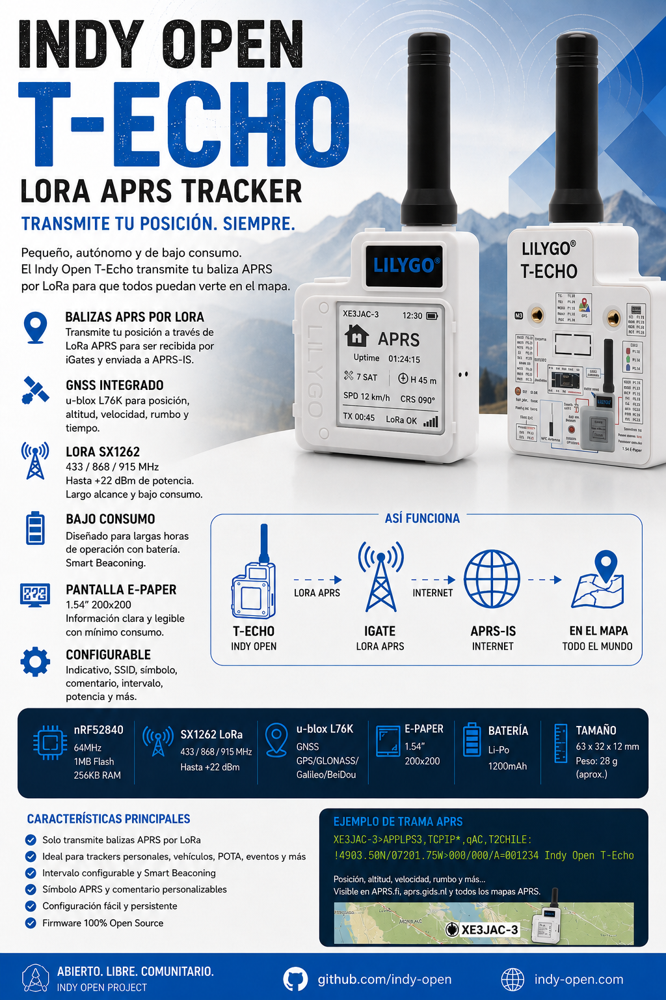

# Indy Open T-Echo



## LoRa APRS Tracker

**Indy Open T-Echo** es un tracker compacto y de bajo consumo basado en el **LILYGO T-Echo**.  
Su función principal es sencilla: obtener la posición GNSS y transmitir periódicamente una **baliza APRS por LoRa** para que pueda ser recibida por un iGate compatible y enviada a **APRS-IS**.

> **T-Echo → LoRa APRS → iGate → APRS-IS → mapa APRS**

El proyecto forma parte de **Indy Open Project**, una iniciativa abierta orientada a experimentar, aprender y desarrollar soluciones de radioafición basadas en hardware accesible y firmware abierto.

---

## Características principales

- Transmisión de balizas **APRS por LoRa**.
- Posición obtenida mediante **GNSS integrado**.
- Indicativo y SSID configurables.
- Símbolo APRS configurable.
- Comentario APRS configurable.
- Intervalo de transmisión configurable.
- Potencia LoRa configurable.
- Smart Beaconing previsto para adaptar la frecuencia de transmisión al movimiento.
- Información de posición, altitud, velocidad y rumbo cuando esté disponible.
- Pantalla **E-Paper de 1.54"**.
- Operación optimizada para bajo consumo.
- Configuración persistente.
- Firmware abierto y modificable.

---

## Objetivo del proyecto

Indy Open T-Echo busca mantener una filosofía muy clara:

**hacer una sola cosa y hacerla bien.**

El dispositivo está pensado principalmente como **tracker APRS LoRa transmisor**.  
La primera versión del firmware no pretende convertirse en mensajero, iGate ni estación APRS completa.

Su función será:

1. Obtener una posición válida mediante GNSS.
2. Construir una baliza APRS.
3. Transmitirla utilizando LoRa.
4. Esperar el siguiente intervalo de transmisión.
5. Repetir el proceso minimizando el consumo de energía.

---

## Flujo de funcionamiento

```text
┌─────────────────┐
│ Indy Open       │
│ T-Echo          │
│ GNSS + LoRa     │
└────────┬────────┘
         │
         │ LoRa APRS
         ▼
┌─────────────────┐
│ iGate           │
│ LoRa APRS       │
└────────┬────────┘
         │
         │ Internet
         ▼
┌─────────────────┐
│ APRS-IS         │
└────────┬────────┘
         │
         ▼
   Mapas / clientes
       APRS
```

---

## Hardware

El proyecto utiliza como plataforma el **LILYGO T-Echo**, que integra los componentes principales necesarios para un tracker portátil:

| Componente | Función |
|---|---|
| nRF52840 | Microcontrolador principal |
| SX1262 | Radio LoRa |
| GNSS | Posicionamiento |
| E-Paper 1.54" | Pantalla de bajo consumo |
| Batería Li-Po | Alimentación portátil |

Las bandas y parámetros concretos de LoRa dependerán de la versión de hardware utilizada y de la configuración regional correspondiente.

---

## Información en pantalla

La interfaz del T-Echo estará orientada específicamente a APRS.

La pantalla podrá mostrar información como:

```text
XE3JAC-3        12:30

        APRS

GPS     7 SAT
ALT     2145 m
SPD     12 km/h
CRS     090°

TX      00:45
LoRa    OK
```

La información final de pantalla podrá cambiar durante el desarrollo para mejorar legibilidad y consumo.

---

## Datos APRS

Una baliza puede incluir:

- Indicativo y SSID.
- Posición.
- Altitud.
- Velocidad.
- Rumbo.
- Símbolo APRS.
- Comentario.

Ejemplo conceptual:

```text
XE3JAC-3>APLPS3:!1903.50N/09812.00W>000/012/A=007041 Indy Open T-Echo
```

El formato exacto utilizado por el firmware podrá evolucionar durante el desarrollo.

---

## TOCALL

Para esta plataforma se contempla el uso de:

```text
APLPS3
```

dentro de la familia de identificadores utilizada por Indy Open para plataformas basadas en **nRF52**.

---

## Smart Beaconing

El proyecto contempla incorporar Smart Beaconing para ajustar automáticamente el intervalo de transmisión según el movimiento.

Por ejemplo:

- detenido → transmisiones más espaciadas;
- caminando → intervalo intermedio;
- vehículo en movimiento → transmisiones más frecuentes;
- cambio importante de dirección → posibilidad de transmitir una nueva baliza.

Esto permite mejorar el seguimiento sin transmitir innecesariamente cuando el equipo permanece inmóvil.

---

## Parámetros previstos

Entre los parámetros configurables se contemplan:

| Parámetro | Descripción |
|---|---|
| Callsign | Indicativo de radioaficionado |
| SSID | Identificador APRS |
| Comentario | Texto incluido en la baliza |
| Símbolo APRS | Icono mostrado en los mapas |
| Intervalo | Tiempo entre balizas |
| Potencia TX | Potencia de transmisión LoRa |
| Smart Beaconing | Activar/desactivar |
| Frecuencia | Según hardware y región |

---

## Bajo consumo

Una de las ventajas principales del T-Echo es su combinación de:

- microcontrolador de bajo consumo;
- pantalla E-Paper;
- radio LoRa;
- GNSS integrado.

El firmware buscará mantener activos únicamente los módulos necesarios en cada momento para maximizar la autonomía.

---

## Estado del proyecto

**En desarrollo.**

Actualmente se encuentra en fase de definición de firmware, interfaz y configuración.

La documentación se actualizará conforme se implementen y validen nuevas funciones.

---

## Filosofía Indy Open

Indy Open busca desarrollar herramientas abiertas para radioaficionados utilizando hardware disponible comercialmente y firmware que pueda:

- estudiarse;
- modificarse;
- compilarse;
- mejorarse;
- compartirse.

La experimentación forma parte del proyecto.

---

## Licencia

El firmware y la documentación del proyecto se publicarán bajo una licencia Open Source compatible con la filosofía de Indy Open Project.

La licencia concreta se indicará junto con la primera publicación estable del código fuente.

---

## Indy Open Project

**Open Source · Open Radio · Experimentación**

Proyecto desarrollado dentro de **Indy Open Project**.

73.
